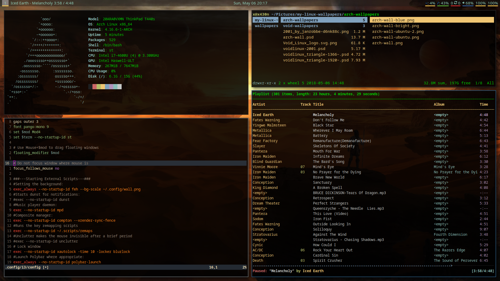

# Install Void Linux

## Credits;

* Luke Smith [voidrice](https://github.com/LukeSmithxyz/voidrice)
* Drew DeVault [dotfiles](https://drewdevault.com/feed.xml)

## Chroot setup

    pacman -S git neovim intel-ucode bash-completion iw wpa_supplicant
    ln -sf /usr/share/zoneinfo/Europe/Zagreb /etc/localtime
    hwclock --systohc
    echo "en_US.UTF-8 UTF-8" >> /etc/locale.gen
    echo LANG=en_US.UTF-8 > /etc/locale.conf
    locale-gen
    echo -e "KEYMAP=dvorak\nFONT=ter-v20b" > /etc/vconsole.conf
    echo x430n > /etc/hostname
    echo -e "127.0.0.1\tlocalhost\n::1\t\tlocalhost\n127.0.1.1\tx430n.localdomain\tx430n" >> /etc/hosts
    mkinitcpio -p linux

    # BIOS grup install
    grub-install --target=i386-pc /dev/sda
    grub-mkconfig -o /boot/grub/grub.cfg

    # create user x and add it to default wheel group + audio and video
    useradd -m -g wheel -G audio,video -s /bin/bash x
    # Set user x password
    passwd x

    # Add wheel group to sudo
    sed -i -e "s|^# %wheel ALL=(ALL) ALL|%wheel ALL=(ALL) ALL|g" visudo
    # Or add wheel grop to sudo and don't ask password
    #sed -i -e "s|^# %wheel ALL=(ALL) NOPASSWD: ALL|%wheel ALL=(ALL) NOPASSWD: ALL|g" visudo

exit && umount -R /mnt && reboot

## Install all apps including AUR

Install Pacman apps

    # Install all needed apps with pacman
    sudo pacman -S base-devel neofetch tlp powertop htop lm_sensors fzf alsa-utils alsa-plugins alsa-lib alsa-firmware xorg-server xorg-xinit xcape xf86-video-intel xf86-input-libinput ranger qutebrowser calcurse mpd mpc mpv compton youtube-dl ffmpeg feh scrot tmux lxappearance xautolock mupdf cmatrix openvpn terminus-font ncmpcpp i3-gaps i3status i3lock acpi tree imagemagick w3m sxiv bind-tools gnumeric r newsboat xclip noto-fonts firefox wget curl libx11 libxft libxinerama freetype2 fontconfig acpi_call-dkms smartmontools gnupg pass openssh dunst dotnet-sdk

Install Packer

    sudo pacman -S --noconfirm --needed grep sed bash curl pacman jshon expac
    mkdir /tmp/packer
    wget https://aur.archlinux.org/cgit/aur.git/plain/PKGBUILD?h=packer
    mv PKGBUILD\?h\=packer /tmp/packer/PKGBUILD
    cd /tmp/packer
    makepkg -i /tmp/packer --noconfirm
    [ -d /tmp/packer ] && rm -rf /tmp/packer
    # Just checking if installation was successful
    if pacman -Qi $package &> /dev/null; then

Install AUR apps

    packer -S yaourt polybar xcalib urlview stride ttf-font-awesome-4 yadm-git openvpn-update-systemd-resolved

## Dotfiles, user folders, ssh...

Crete user's folders

    mkdir ~/Videos ~/Documents ~/Downloads ~/Pictures ~/Music ~/src

Create src folder and clone dotfiles

    cd ~/src
    git clone https://github.com/xajler/voidlinux-i3.git
    git fetch
    # Checkout to archlinux branch
    get checkout archlinux

Create /mnt/usb dir and mount to it

    sudo mkdir /mnt/usb
    sudo mount /dev/sdb1 /mnt/usb

Copy .ssh and chmod-it

    cp -rf /mnt/usb/.ssh/ ~/
    cd ~/.ssh/
    rm known_hosts
    chmod 600 id_rsa
    chmod 644 id_rsa.pub

Copy dotfiles to home folder

    cd ~/src/voidlinux-i3
    cp -rf *  ~/
    source .bash_profile

Install Vim Plugs (inside neovim)

    vim
    :PlugInstall

## Configuration

### Services

    sudo systemctl enable dhcpcd
    sudo systemctl start dhcpcd
    sudo systemctl enable systemd-resolved.service
    sudo systemctl start systemd-resolved.service

### Wifi

WiFi config (WPA)

    # enter root
    sudo su

    # Create /etc/wpa_supplicant/wpa_supplicant-wlp3s0.conf (for interface wlp3s0)
    echo -e "# Default configuration file for wpa_supplicant.conf(5).\n\nctrl_interface=/run/wpa_supplicant\nctrl_interface_group=wheel\neapol_version=1\nap_scan=1\nfast_reauth=1\nupdate_config=1\n\n# Add here your networks." > /etc/wpa_supplicant/wpa_supplicant-wlp3s0.conf
    # Change <ssid> <pass>
    wpa_passphrase <ssid> <pass> >> /etc/wpa_supplicant/wpa_supplicant-wlp3s0.conf

    # Enable and run service (make sure dhcpcd is running)
    sudo systemctl enable wpa_supplicant@wlp3s0.service
    sudo systemctl start wpa_supplicant@wlp3s0.service

    # test confing without running service
    wpa_supplicant -i wlp3s0 -c /etc/wpa_supplicant/wpa_supplicant-wlp3s0.conf

    # exit root
    exit

    # set up wifi and test it
    sudo ip link set wlp3s0 up
    ip addr
    ping -c 3 ksphoto.me

Multiple WiFi networks (WPA)

    # TODO

WiFi WEP notes

    # enter root
    su
    cp /etc/wpa_supplicant/wpa_supplicant.conf /etc/wpa_supplicant/wpa_supplicant-<SSID-name>.conf
    sudo vim /etc/wpa_supplicant/wpa_supplicant-<SSID-name>.conf
    # Add this text and change SSID and Wep key:
    network={
        ssid="MYSSID"
        key_mgmt=NONE
        wep_key0="YOUR AP WEP KEY"
        wep_tx_keyidx=0
        auth_alg=SHARED
    }

Temporary WiFi config (WPA)

    sudo sv stop wpa_supplicant
    # enter root
    su
    cp /etc/wpa_supplicant/wpa_supplicant.conf /etc/wpa_supplicant/wpa_supplicant-<SSID-name>.conf
    wpa_passphrase <SSID> <password> >> /etc/wpa_supplicant/wpa_supplicant-<SSID-name>.conf

    # Run and connect
    wpa_supplicant -i wlp3s0 -c /etc/wpa_supplicant/wpa_supplicant-<SSID-name>.conf &

### OpenVPN & ProtonVPN

    # copy login.conf with ProtonVPN credentials
    sudo cp login.conf /etc/openvpn
    sudo chown root:root /etc/openvpn/login.conf
    sudo chmod 600 /etc/openvpn/login.conf

    # TODO: patch all at once
    # Patch ProtonVPN .ovpn file
    ./patch-protonvpn.sh de-05.protonvpn.com.udp1194.ovpn
    # TODO: script to stop current, enable and/or start new one by name

    # Copy and rename ProtonVPN .ovpn file
    sudo cp de-05.protonvpn.com.udp1194.ovpn /etc/openvpn/client
    sudo mv de-05.protonvpn.com.udp1194.ovpn de-05.conf

    # Enable and start service (make sure service systemd-resolved.service is enabled
    and running)
    sudo systemctl enable openvpn-client@de-05
    sudo systemctl start openvpn-client@de-05

    # patch-protonvpn.sh script still needs more features
    #!/bin/sh

    sed -i -e "s|^auth-user-pass|auth-user-pass /etc/openvpn/client/login.conf|g" \
           -e "s|^up /etc/openvpn/update-resolv-conf|up /etc/openvpn/scripts/update-systemd-resolved|g" \
           -e "s|^down /etc/openvpn/update-resolv-conf|down /etc/openvpn/scripts/update-systemd-resolved|g" $1

### Bluetooth

Bluetooh

    sudo pacman -S bluez
    # Turn off bluetooth, use 'on' to turn it  on
    sudo bluetooth off
    # TODO: is this working for arch too?
    # use rc.local to turn it off on startup

### Audio

Test sound with speakers and headphones

    # make sure nothing is at 0
    alsamixer

Sound problems mulitpile card (ThinkPad t440s)

    # Create alsa-base.conf if not existed
    sudo vim  /etc/modprobe.d/alsa-base.conf

    # Add this content int o alsa-base.conf (swaps sound cards, so 1 is defaust)
    options snd-hda-intel index=1,0

### Misc

Test calibration file
    # Get display name
    echo $DISPLAY

    # Test running Lenovo ThinkPad x220
    xcalib -d :0 .config/icc/Profiles/Color-LCD-#1-2016-02-16-02-0-2.2-F-S-XYZLUT+MTX.icc

Nodejs - npm

    Read in [npm docs](https://docs.npmjs.com/getting-started/fixing-npm-permissions)

    sudo xbps-install -S nodejs-lts-boron
    mkdir ~/.npm-global
    npm config set prefix '~/.npm-global'
    # Add to .bash_profile
    export PATH=~/.npm-global/bin:$PATH
    source ~/.bash_profile

